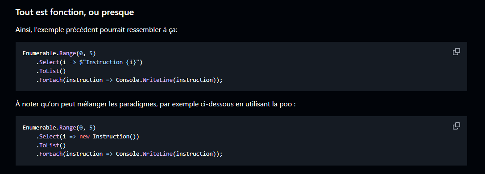
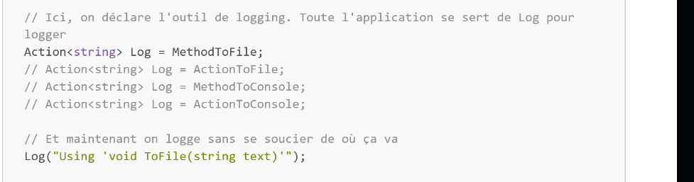

# 27/08/2025

### Impératif
- C'est genre une recette de cuisine pas à pas.
- Prend plus de temps mais c'est plus detaillé.

### Déclaratif 
- C'et genre une recette de cuisine simplifié. 
- C'est plus rapide mais, si on veut faire des conditions il faut faire plusieurs trucs. 
- La syntaxe se raseemble à Mongo.

    
- #### VAR
    - C'est pour déclarer une valeur de n'importe quel type. C'est pour faire une fonction.

### Fonctions supplémentaires

- #### Fonctions -> Au lieu de faire une fonction en syntaxe de méthode comment on connait déjà, on commencera à faire avec ACTION (en une seule ligne). 
    - On peut appeler une fonction et utiliser un commentaire
        
        